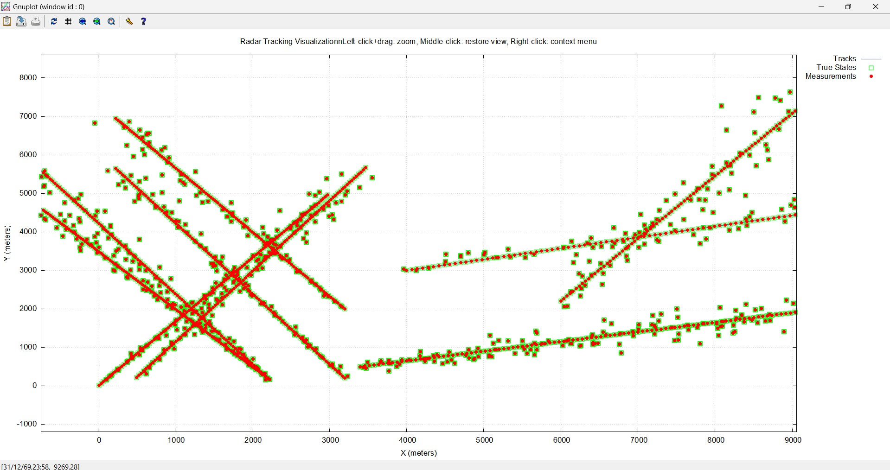

# Radar-Target-Tracking

## Overview

This project implements a **Radar Target Tracking and Simulation** system using C++ and the Eigen library. It provides a framework for simulating radar measurements of moving targets and then applying a **Global Nearest Neighbor (GNN) filter** to track these targets. The simulation results, including true target states, raw radar measurements, and the estimated tracks, are visualized interactively using Gnuplot.

This system is ideal for understanding fundamental concepts in target tracking, sensor fusion, and real-time state estimation in dynamic environments.

## Features

* **Target Truth Simulation:** Generates realistic trajectories for multiple targets over time.
* **Radar Measurement Generation:** Simulates radar detections, accounting for sensor noise and measurement characteristics (range and azimuth).
* **Global Nearest Neighbor (GNN) Filtering:** Implements a GNN-based Kalman filter (or extended Kalman filter variant) for associating measurements with existing tracks and updating target states.
* **Interactive Gnuplot Visualization:** Automatically generates Gnuplot data and script files to provide a dynamic visualization of:
    * **True Target Paths** (Ground Truth)
    * **Simulated Radar Measurements** (Detections)
    * **Estimated Target Tracks** (Filter Output)
    * Includes interactive features like zooming, panning, and a reset view option.
* **Modular Design:** Structured with multiple header and source files for clear separation of concerns (e.g., `Radar.h`, `Track.h`, `GNN_filter.h`, `parameters.h`).
* **Eigen Library Integration:** Leverages the Eigen C++ template library for efficient and powerful linear algebra operations, crucial for Kalman filtering.

## Getting Started

To get this project up and running on your local machine, follow these steps:

### Prerequisites

You'll need the following installed on your system:

* **Git:** For cloning the repository.
* **A C++ Compiler:**
    * **Windows:** MinGW-w64 (e.g., via MSYS2) or Visual Studio with C++ tools.
    * **Linux/macOS:** GCC or Clang.
* **Eigen Library:** A header-only C++ template library for linear algebra. You don't need to compile it, just download the headers.
    * Download from: [https://eigen.tuxfamily.org/](https://eigen.tuxfamily.org/)
* **Gnuplot:** For plotting and visualization.
    * Download from: [http://www.gnuplot.info/](http://www.gnuplot.info/)
    * Ensure `gnuplot` is added to your system's PATH environment variable.

### Installation

1.  **Clone the Repository:**
    ```bash
    git clone [https://github.com/KeerthiLBangera/Radar-Target-Tracking.git](https://github.com/KeerthiLBangera/Radar-Target-Tracking.git)
    cd Radar-Target-Tracking
    ```

2.  **Place Eigen Headers:**
    * Download the Eigen library.
    * Extract the `Eigen` folder (containing all the Eigen header files) into your `Radar-Target-Tracking` project directory, or to a location where your compiler can find it (e.g., `/usr/local/include` on Linux/macOS). A common practice is to place the `Eigen` folder directly inside your project's root.

### Building the Project

Navigate to the project's root directory in your terminal and compile the source code.

**Example Compilation Command (Linux/macOS/MinGW-w64):**

```bash
g++ -std=c++17 -I. -Ipath/to/eigen -o radar_tracker \
    main.cpp Anglefft.cpp CA_GOCA.cpp DBSCAN.cpp GNN_association.cpp \
    GNN_filter.cpp initialize.cpp parameters.cpp radar_info.cpp \
    simulate_target_truth.cpp target_info.cpp track_manager.cpp \
    get_measurements_radar.cpp RSPchain_odd.cpp simulated_output.cpp
```
### Output

